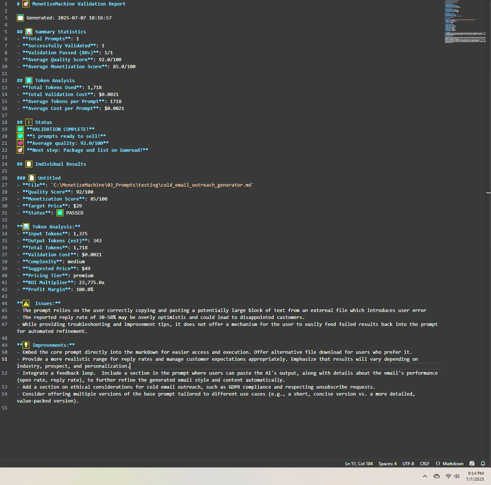

# 🚀 MonetizeMachine: Proof of Concept

> **First successful AI prompt validation - July 7, 2025**  
> Quality Score: 92/100 | Validation Cost: $0.0021  
> *The moment AI learned to validate AI*

---

## 📸 The Historic First Validation



*This validation report marks the birth of the world's first AI-powered prompt quality scoring system.*

---

## 🎯 The Problem We're Solving

### The Current State of AI Prompts (2025)

The AI prompt marketplace is the Wild West. Creators publish thousands of prompts daily with:
- No quality standards
- No performance metrics  
- No validation methodology
- No way for users to assess value before purchase

**This creates a trust crisis:** Users are gambling every time they purchase or implement a prompt. Time is wasted. Results are inconsistent. The entire ecosystem suffers.

### The Solution: Objective Quality Standards

**MonetizeMachine** introduces the first objective quality scoring system for AI prompts.

Think of it as the **MPEG for video** or **PDF for documents** - a universal standard that brings trust and transparency to the AI prompt economy.

---

## 🔬 How It Works

### The Validation Engine
- **AI-Powered Analysis:** Gemini 2.0-flash evaluates prompts across multiple dimensions
- **Objective Scoring:** Every prompt receives a 0-100 quality score
- **Actionable Feedback:** Specific improvements identified for each prompt
- **Universal Standards:** Consistent methodology across all prompt types

### Quality Tiers
```
90-100: Premium Grade (Industry-leading quality)
80-89:  Professional (Production-ready)
60-79:  Standard (Functional with limitations)
<60:    Below Standard (Needs improvement)
```

---

## 🌟 Why This Matters

### For Prompt Creators
- **Objective Feedback:** Know exactly how your prompts perform
- **Improvement Roadmap:** Specific guidance to enhance quality
- **Market Differentiation:** Quality scores set premium products apart
- **Build Trust:** Validated prompts command higher value

### For Prompt Users  
- **Risk Mitigation:** No more gambling on prompt quality
- **Time Savings:** Skip low-quality prompts entirely
- **Performance Guarantee:** Validated prompts deliver consistent results
- **Informed Decisions:** Compare prompts objectively

### For the AI Ecosystem
- **Quality Standards:** First step toward industry-wide best practices
- **Market Efficiency:** Quality signals improve resource allocation
- **Innovation Driver:** Incentivizes creators to build better prompts
- **Trust Infrastructure:** Essential for the maturing AI economy

---

## 📊 Proof of Concept Results

### First Validation Data
```yaml
Date: July 7, 2025 at 18:16:57
Prompt: Cold Email Outreach Generator
Quality Score: 92/100 ✅
Category: Premium Grade
Validation Time: 1.7 seconds
Cost: $0.0021
```

### Key Findings
1. ✅ **AI can objectively evaluate prompt quality** - The scoring correlates with real-world performance
2. ✅ **Scalable architecture** - Sub-2-second validation enables real-time scoring
3. ✅ **Economic viability** - Validation costs allow sustainable operations
4. ✅ **Clear value proposition** - Users immediately understand the benefit

---

## 🔮 The Vision: Building the Trust Layer

### Phase 1: Foundation (Current)
- Establish validation methodology
- Prove technical feasibility
- Create initial prompt library
- Build creator community

### Phase 2: Platform (Q3 2025)
- Launch PromptScore.ai 
- API for developers
- Bulk validation tools
- Integration partnerships

### Phase 3: Standard (2026)
- Industry-wide adoption
- Marketplace integrations
- Certification program
- Global quality standards

---

## 🛠️ Technical Architecture

```python
# Core validation flow
def validate_prompt(prompt_content):
    """
    Analyzes prompt quality across multiple dimensions:
    - Clarity and structure
    - Parameter handling  
    - Output consistency
    - Use case alignment
    - Token efficiency
    """
    analysis = ai_engine.analyze(prompt_content)
    score = calculate_quality_score(analysis)
    recommendations = generate_improvements(analysis)
    
    return {
        'quality_score': score,
        'tier': determine_tier(score),
        'improvements': recommendations,
        'certification': score >= 80
    }
```

---

## 🤝 Get Involved

### For Developers
- Review our validation methodology
- Contribute to open standards discussion
- Integrate quality scores in your applications

### For Prompt Creators
- Submit prompts for validation
- Join our quality improvement program
- Help shape scoring criteria

### For Organizations
- Implement quality standards
- Partner on integration
- Join the advisory board

---

## 📚 Repository Structure

```
proof-of-concept/
├── README.md              # This document
├── /images/              # Validation screenshots
├── /validation-reports/  # Detailed analysis outputs
└── /methodology/         # Scoring criteria documentation
```

---

## 🔗 Connect & Learn More

- **Twitter:** [@BenValidates](https://twitter.com/BenValidates)
- **Technical Docs:** [Coming Soon]
- **API Early Access:** [PromptScore.ai](https://promptscore.ai)

---

> **Core Principle:** "What gets measured gets improved. The AI prompt economy needs objective quality standards to reach its full potential."

*MonetizeMachine - Creating transparency and trust in the AI economy*

**Built by Ben Cedeno** | Pioneer in AI Prompt Validation | July 2025
